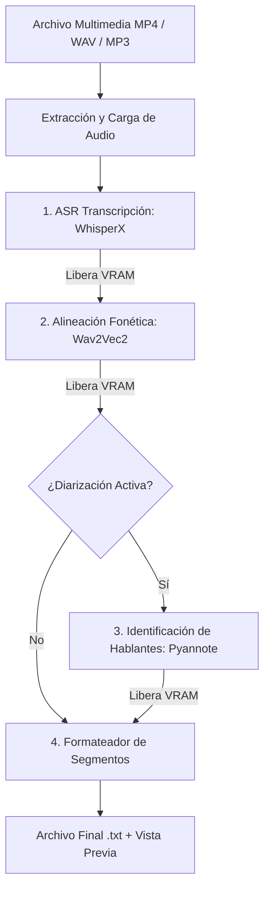

# 🎙️ WhisperX Transcriptor Pro

[](https://huggingface.co/spaces/Klopezxd/transcriptor-whisperx)


> **Pipeline de transcripción de audio/video de alta fidelidad, alineación fonética de marcas de tiempo a nivel de palabra y diarización de hablantes (separación de interlocutores).**

*Read this document in English: [README.md](README.md)*

---

## 🌟 Características Principales

* 🚀 **Inferencia Ultra-Rápida:** Basado en **WhisperX** (faster-whisper / CTranslate2), hasta 5 veces más rápido que Whisper estándar.
* 🎯 **Alineación Fonética Precisa:** Integra modelos **Wav2Vec2** para alinear el texto fonéticamente a marcas de tiempo exactas por palabra.
* 👥 **Diarización de Hablantes:** Identifica y separa automáticamente quién dijo qué mediante **Pyannote Audio 3.1**.
* ⚡ **Optimización VRAM (4GB Ready):** Diseñado con cuantización `INT8` y recolección agresiva de memoria entre fases, permitiendo ejecución fluida en GPUs de consumo (ej. NVIDIA GTX 1650 con 4GB VRAM) y en **Hugging Face ZeroGPU**.
* 🖥️ **Doble Interfaz (Web + CLI):**
  * **Web UI (Gradio):** Interfaz moderna y accesible desde el navegador.
  * **CLI (Terminal):** Soporte de argumentos completos (`argparse`) con selector gráfico interactivo de respaldo (Tkinter).
* 🔒 **Seguridad y Clean Code:** Arquitectura desacoplada, tipado estricto (Type Hinting), logging estructurado y gestión segura de secretos vía variables de entorno (`HF_TOKEN` / `.env`).

---

## 🌐 Demo en Vivo

Puedes probar la aplicación inmediatamente sin instalar nada en tu máquina:

👉 **[Abrir en Hugging Face Spaces: Klopezxd/transcriptor-whisperx](https://huggingface.co/spaces/Klopezxd/transcriptor-whisperx)**

---

## 🏗️ Arquitectura del Pipeline

El pipeline procesa el archivo multimedia en 5 etapas secuenciales con liberación forzada de VRAM entre cada una:



---

## 📋 Requisitos del Sistema

* **Sistema Operativo:** Windows 10/11 o Linux (Ubuntu 20.04+).
* **Python:** 3.10 (recomendado).
* **FFmpeg:** Instalado en el sistema y disponible en el `PATH`.
* **Hardware GPU (Opcional pero recomendado):** NVIDIA GeForce GTX 1650 o superior con drivers actualizados y soporte CUDA 12.x. (También funciona en CPU).

---

## 🚀 Instalación Local

### Opción 1: Con Conda / Miniconda (Recomendado)

```bash
# 1. Clonar el repositorio
git clone https://github.com/Klopezxd/whisperx-transcriptor.git
cd whisperx-transcriptor

# 2. Crear el entorno aislado con Python 3.10
conda create -n transcriptor python=3.10 -y
conda activate transcriptor

# 3. Instalar PyTorch con aceleración CUDA 12.x
pip install torch==2.8.0 torchvision==0.23.0 torchaudio==2.8.0 --index-url https://download.pytorch.org/whl/cu126

# 4. Instalar WhisperX y dependencias del proyecto
pip install -r requirements.txt

# 5. Verificar aceleración GPU
python -c "import torch; print('CUDA disponible:', torch.cuda.is_available())"
```

### Opción 2: Con entorno virtual venv estándar

```bash
python -m venv venv
# En Windows:
.\venv\Scripts\activate
# En Linux:
source venv/bin/activate

pip install -r requirements.txt
```

---

## 🔑 Configuración del Token de Hugging Face (Diarización)

La identificación de interlocutores requiere el modelo `pyannote/speaker-diarization-3.1`. Para utilizarlo:

1. Crea una cuenta gratuita en [Hugging Face](https://huggingface.co/).
2. Acepta los términos de uso en:
   * [pyannote/speaker-diarization-3.1](https://huggingface.co/pyannote/speaker-diarization-3.1)
   * [pyannote/segmentation-3.0](https://huggingface.co/pyannote/segmentation-3.0)
3. Genera un Token de lectura en [Hugging Face Settings](https://huggingface.co/settings/tokens).
4. Configúralo en tu entorno:
   ```bash
   # Copiar la plantilla de ejemplo
   cp .env.example .env
   # Editar .env y colocar:
   HF_TOKEN=hf_tu_token_aqui
   ```
   *También puedes pasarlo como argumento `--token` en la CLI o introducirlo en el campo correspondiente en la Web UI.*

---

## 💻 Guía de Uso

### 1. Interfaz Web (Gradio)

Lanza el servidor local con:

```bash
python app.py
```
Abre tu navegador en `http://127.0.0.1:7860` para usar la interfaz visual.

---

### 2. Interfaz de Línea de Comandos (CLI)

```bash
# Modo interactivo (abre ventana gráfica para elegir el archivo si no pasas -i):
python cli.py

# Transcripción directa con modelo turbo:
python cli.py -i "video_clase.mp4" -m large-v3-turbo

# Transcripción con Diarización (identificación de personas):
python cli.py -i "reunion.mp4" -d

# Guardar en carpeta específica con formato de marcas de tiempo en rango:
python cli.py -i "conferencia.wav" --timestamps range -o "./transcripciones"
```

#### Opciones CLI disponibles:

| Flag | Tipo | Descripción | Por defecto |
|---|---|---|---|
| `-i`, `--input` | String | Ruta al archivo multimedia. Si se omite, abre selector gráfico. | `None` |
| `-m`, `--model` | Choice | `large-v3-turbo`, `large-v3`, `medium`, `small`, `base` | `large-v3-turbo` |
| `-d`, `--diarize` | Flag | Activa la identificación de hablantes (requiere token). | `False` |
| `--timestamps` | Choice | Formato de tiempo: `simple`, `range`, `none` | `simple` |
| `-t`, `--token` | String | Token explícito de Hugging Face. | Variable `HF_TOKEN` |
| `--compute-type` | Choice | Cuantización: `int8` (recomendado 4GB), `float16`, `float32` | `int8` |
| `-o`, `--output-dir` | String | Directorio destino para el `.txt`. | Mismo del archivo |

---

## 📁 Estructura del Proyecto

```text
whisperx-transcriptor/
├── .github/
│   └── workflows/
│       ├── sync-to-hf.yml       # CI/CD: Sincronización automática con Hugging Face Spaces
│       └── lint.yml             # Análisis estático de código con Ruff
├── src/
│   ├── __init__.py
│   ├── config.py                # Dataclasses inmutables y enums (Clean Code)
│   ├── transcriber.py           # Pipeline orquestador WhisperX + Pyannote
│   └── utils.py                 # Funciones puras de VRAM, formateo y seguridad
├── app.py                       # Interfaz Web Gradio (Local + ZeroGPU)
├── cli.py                       # Interfaz CLI avanzada
├── requirements.txt             # Dependencias Python
├── packages.txt                 # Dependencias del SO (FFmpeg en HF Spaces)
├── environment.yml              # Definición de entorno Conda
├── .env.example                 # Plantilla de credenciales
├── .gitignore                   # Exclusión estricta de medios y temporales
├── pyproject.toml               # Configuración de empaquetado y linters
├── LICENSE                      # Licencia MIT
├── README.md                    # Documentación en Español
└── README.en.md                 # Documentación en Inglés
```

---

## 🔄 Despliegue Continuo (CI/CD)

El repositorio incluye un workflow en [`.github/workflows/sync-to-hf.yml`](.github/workflows/sync-to-hf.yml). Cada vez que hagas `git push` a la rama `main` de GitHub, el código se sincroniza automáticamente con tu Space de Hugging Face.

**Para activarlo:**
1. En tu repositorio de GitHub, ve a **Settings** > **Secrets and variables** > **Actions**.
2. Añade un **New repository secret**:
   * **Nombre:** `HF_TOKEN`
   * **Valor:** Tu token de Hugging Face con permisos de escritura (*Write*).

---

## 📄 Licencia y Autoría

* **Autor:** [Klever López](https://github.com/Klopezxd)
* **Licencia:** MIT License — libre para uso personal, académico y comercial.

