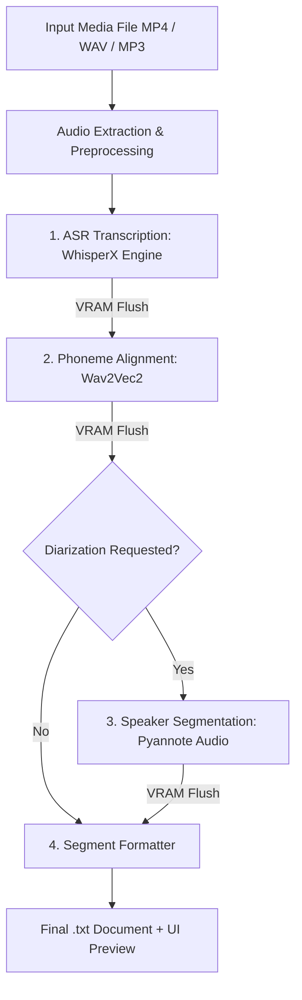

# WhisperX Audio Transcriptor & Diarization Pipeline

[](https://huggingface.co/spaces/Klopezxd/transcriptor-whisperx)


> High-throughput speech transcription pipeline featuring word-level phoneme alignment and speaker diarization using WhisperX and Pyannote Audio.

*Leer este documento en Español: [README.es.md](README.es.md)*

---

## Key Features

* **High-Throughput ASR:** Powered by **WhisperX** (faster-whisper / CTranslate2), delivering up to $5\times$ speedups over vanilla Whisper implementations.
* **Word-Level Phoneme Alignment:** Incorporates **Wav2Vec2** acoustic models to achieve exact word-boundary timestamp alignment.
* **Speaker Diarization:** Identifies and segments discrete speakers seamlessly using **Pyannote Audio 3.1**.
* **Consumer GPU & ZeroGPU Ready:** Architected with `INT8` quantization and explicit VRAM garbage collection between pipeline stages, running efficiently on 4GB VRAM cards (e.g., NVIDIA GeForce GTX 1650) as well as **Hugging Face ZeroGPU** runners.
* **Dual Interface (Web + CLI):**
  * **Web UI (Gradio):** Interactive browser application.
  * **CLI (Terminal):** Fully featured command-line interface with interactive graphical file picker fallback.
* **Production Engineering:** Explicit type hints, structured logging, decoupled domain logic, and secure environment-based credential handling.

---

## Live Interactive Demo

Test the pipeline directly on Hugging Face Spaces:

👉 **[Launch on Hugging Face Spaces: Klopezxd/transcriptor-whisperx](https://huggingface.co/spaces/Klopezxd/transcriptor-whisperx)**

---

## Pipeline Architecture

The transcription workflow executes across 5 isolated stages, clearing GPU VRAM at each boundary to prevent Out-Of-Memory (OOM) faults:



---

## System Requirements

* **OS:** Windows 10/11 or Linux (Ubuntu 20.04+).
* **Python:** 3.10 (recommended).
* **FFmpeg:** Installed and exported to system `PATH`.
* **Hardware GPU (Optional):** NVIDIA GeForce GTX 1650 or greater with CUDA 12.x support (CPU fallback fully supported).

---

## Installation & Setup

### Conda Environment (Recommended)

```bash
# Clone the repository
git clone https://github.com/Klopezxd/whisperx-transcriptor.git
cd whisperx-transcriptor

# Create and activate isolated Python 3.10 environment
conda create -n transcriptor python=3.10 -y
conda activate transcriptor

# Install PyTorch with CUDA 12.x wheel
pip install torch==2.8.0 torchvision==0.23.0 torchaudio==2.8.0 --index-url https://download.pytorch.org/whl/cu126

# Install dependencies
pip install -r requirements.txt

# Verify CUDA acceleration
python -c "import torch; print('CUDA Ready:', torch.cuda.is_available())"
```

---

## Hugging Face Authentication (Speaker Diarization)

Speaker diarization leverages gated models from Pyannote. To enable it:

1. Create a free account at [Hugging Face](https://huggingface.co/).
2. Accept model usage terms:
   * [pyannote/speaker-diarization-3.1](https://huggingface.co/pyannote/speaker-diarization-3.1)
   * [pyannote/segmentation-3.0](https://huggingface.co/pyannote/segmentation-3.0)
3. Generate a read-access token under [Hugging Face Settings](https://huggingface.co/settings/tokens).
4. Export the token:
   ```bash
   cp .env.example .env
   # Add your token to .env:
   HF_TOKEN=hf_your_token_here
   ```

---

## Execution Modes: Cloud vs. Local

| Execution Mode | Best For | Key Advantage | Constraints |
|---|---|---|---|
| **Hugging Face Spaces (Cloud)** | Short-to-medium files (< 20-30 mins), instant access | Zero install; runs on cloud NVIDIA A10G (24GB VRAM) | Subject to daily ZeroGPU community quotas |
| **Local Execution (PC)** | Long recordings (1 to 5+ hours), batch jobs, private/sensitive data | Unlimited processing time, 100% offline privacy | Uses local machine hardware (GPU/CPU) |

---

## Usage

### 1. Windows One-Click Launcher (Desktop)

Double-click `run_transcriptor.bat` in the project root (or run it via terminal). It automatically activates the `transcriptor` environment and opens the graphical file picker dialog.

---

### 2. Local Web Application (Gradio)

Run the full interactive web application locally on your machine:

```bash
python app.py
```
Navigate to `http://127.0.0.1:7860` in any modern web browser.

---

### 3. Command Line Interface (CLI)

```bash
# Interactive mode (opens file selection dialog if no -i argument is provided):
python cli.py

# Direct processing with turbo model:
python cli.py -i "lecture.mp4" -m large-v3-turbo

# Enable multi-speaker diarization:
python cli.py -i "interview.mp4" -d

# Custom output directory with range timestamps:
python cli.py -i "meeting.wav" --timestamps range -o "./transcripts"
```

#### Available CLI Arguments:

| Flag | Type | Description | Default |
|---|---|---|---|
| `-i`, `--input` | String | Path to media file (launches GUI picker if omitted). | `None` |
| `-m`, `--model` | Choice | `large-v3-turbo`, `large-v3`, `medium`, `small`, `base` | `large-v3-turbo` |
| `-d`, `--diarize` | Flag | Enables speaker diarization (requires token). | `False` |
| `--timestamps` | Choice | Timestamp formatting: `simple`, `range`, `none` | `simple` |
| `-t`, `--token` | String | Hugging Face token override. | `HF_TOKEN` env |
| `--compute-type` | Choice | Quantization: `int8` (recommended for 4GB), `float16`, `float32` | `int8` |
| `-o`, `--output-dir` | String | Output folder for `.txt` transcripts. | Source directory |

---

## Repository Structure

```text
whisperx-transcriptor/
├── .github/
│   └── workflows/
│       ├── sync-to-hf.yml       # Continuous Deployment to Hugging Face Spaces
│       └── lint.yml             # Code quality and linting via Ruff
├── src/
│   ├── __init__.py
│   ├── config.py                # Strongly typed dataclasses & enums
│   ├── transcriber.py           # Core decoupled WhisperX orchestration pipeline
│   └── utils.py                 # Pure helper functions, memory management, and security
├── app.py                       # Gradio Web UI entrypoint (Local + ZeroGPU)
├── cli.py                       # Advanced CLI entrypoint
├── requirements.txt             # Python dependencies
├── packages.txt                 # OS packages (FFmpeg for Hugging Face Spaces)
├── environment.yml              # Conda environment definition
├── .env.example                 # Credential template
├── .gitignore                   # Strict exclusions for artifacts and large media
├── pyproject.toml               # Modern packaging metadata & Ruff configuration
├── LICENSE                      # MIT License
├── README.md                    # English documentation (Primary)
└── README.es.md                 # Spanish documentation
```

---

## License & Authorship

* **Author:** [Klever López](https://github.com/Klopezxd)
* **License:** MIT License — Open source for academic, professional, and personal use.

